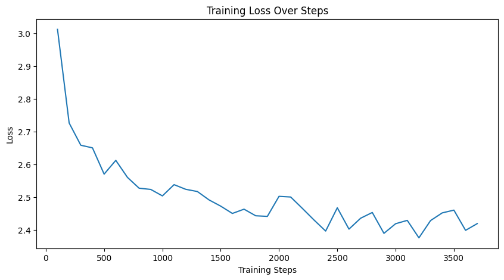

# Abstractive Headline Generation with BART

This project implements an abstractive headline generation system using the BART (Bidirectional and Auto-Regressive Transformer) model from Hugging Face. The system is trained on the CNN/DailyMail dataset to generate concise and meaningful headlines from news articles. The project includes data preprocessing, model training with Parameter-Efficient Fine-Tuning (PEFT) using LoRA, evaluation, visualization of training metrics, and a Gradio-based web interface for deployment.

## Table of Contents
- [Project Overview](#project-overview)
- [Features](#features)
- [Project Structure](#project-structure)
- [Requirements](#requirements)
- [Setup Instructions](#setup-instructions)
- [Usage](#usage)
  - [Training the Model](#training-the-model)
  - [Deploying the Gradio Interface](#deploying-the-gradio-interface)
- [Colab Notebook](#colab-notebook)
- [Screenshots](#screenshots)
- [Contributing](#contributing)
- [Acknowledgments](#acknowledgments)

## Project Overview
The goal of this project is to develop a machine learning model capable of generating abstractive headlines for news articles. It leverages the BART model fine-tuned on a subset of the CNN/DailyMail dataset (10,000 samples). The implementation uses PyTorch, Hugging Face's Transformers library, and PEFT with LoRA to reduce the number of trainable parameters, making it memory-efficient. The trained model is deployed via a Gradio interface for interactive headline generation.

*"Due to computational limitations, the model was trained on a small subset of the dataset (10,000 samples) with only 3 epochs. This setup is intended to demonstrate that the loss curve is decreasing and that the training process is functioning correctly. With more training data and additional epochs, the model's performance would significantly improve."*  

## Features
- **Data Preprocessing**: Cleans and prepares the CNN/DailyMail dataset for training.
- **Model Training**: Fine-tunes BART-base with LoRA for efficient headline generation.
- **Evaluation**: Assesses model performance on a validation set.
- **Visualization**: Plots training loss and dataset statistics (article/headline length distributions).
- **Deployment**: Provides a user-friendly Gradio web interface to generate headlines from input articles.

## Project Structure
```
Abstractive_Headline_Generation_with_BART/
├── config.py          # Configuration class with hyperparameters and settings
├── data_utils.py      # Data loading, analysis, preprocessing, and dataset creation
├── model_utils.py     # Model setup and tokenization utilities
├── train_eval.py      # Training and evaluation logic
├── visualize.py       # Visualization utilities for training metrics
├── inference.py       # Inference function for headline generation
├── main.py            # Main script for training and evaluation
├── requirements.txt   # List of Python dependencies
├── README.md          # Project documentation (this file)
├── images/            # Directory containing project screenshots
│   ├── gradio_deployment.png  # Screenshot of Gradio interface
│   └── Loss_curve.png         # Screenshot of training loss plot
├── Abstractive_Headline_Generation_with_BART.ipynb  # Colab notebook with full implementation
└── app.py             # Gradio deployment script with model loading
```

## Requirements
The project dependencies are listed in `requirements.txt`. Key libraries include:
- `datasets` - For loading the CNN/DailyMail dataset
- `torch` - PyTorch for model training
- `transformers` - Hugging Face's library for BART
- `peft` - Parameter-Efficient Fine-Tuning with LoRA
- `numpy`, `matplotlib`, `pandas`, `seaborn` - For data analysis and visualization
- `gradio` - For the web interface

Install the dependencies using:
```bash
pip install -r requirements.txt
```

## Setup Instructions
1. **Clone the Repository**:
   ```bash
   git clone --no-checkout https://github.com/HimadeepRagiri/ML-and-DL-Projects.git
   cd ML-and-DL-Projects
   git sparse-checkout init --cone
   git sparse-checkout set NLP_Projects/Abstractive_Headline_Generation_with_BART
   cd NLP_Projects/Abstractive_Headline_Generation_with_BART
   ```

2. **Install Dependencies**:
   ```bash
   pip install -r requirements.txt
   ```

3. **(Optional) Run in Colab**:
   - Open `Abstractive_Headline_Generation_with_BART.ipynb` in Google Colab for a complete walkthrough, including training and visualization.

4. **Prepare the Environment**:
   - Ensure you have a compatible GPU for faster training (optional but recommended).
   - The model saves checkpoints to `./results` by default (configurable in `config.py`).

## Usage

### Training the Model
To train the model and evaluate its performance:
1. Run the main script:
   ```bash
   python main.py
   ```
2. The script will:
   - Load and preprocess the CNN/DailyMail dataset.
   - Train the BART model with LoRA for 3 epochs (configurable in `config.py`).
   - Generate visualizations (e.g., training loss plot).
   - Save the trained model to `./results`.
   - Test inference on a sample article from the validation set.

### Deploying the Gradio Interface
To deploy the trained model as a web interface:
1. Ensure the model is trained and saved in `./results`.
2. Run the deployment script:
   ```bash
   python app.py
   ```
3. A Gradio interface will launch in your browser, allowing you to input article text and generate headlines. A public URL will also be provided for sharing.

**Note**: If the model checkpoint is saved in a subdirectory (e.g., `./results/checkpoint-500`), update the model loading path in `app.py` accordingly.

## Colab Notebook
The file `Abstractive_Headline_Generation_with_BART.ipynb` contains the full implementation in a Google Colab environment. It includes:
- Data loading and analysis
- Model training and evaluation
- Visualization of results
- Example inference
This is ideal for running the project without local setup, leveraging Colab's free GPU resources.

## Screenshots
### Gradio Deployment


### Training Loss Curve


## Contributing
Contributions are welcome! To contribute:
1. Fork the repository.
2. Create a new branch (`git checkout -b feature-branch`).
3. Make your changes and commit (`git commit -m "Add feature"`).
4. Push to your branch (`git push origin feature-branch`).
5. Open a Pull Request.

Please ensure your code follows the existing style and includes appropriate documentation.

## Acknowledgments
- Hugging Face for the Transformers library and datasets.
- The CNN/DailyMail dataset creators.
- Gradio for the easy-to-use deployment framework.
- The open-source community for tools like PyTorch and PEFT.

---
