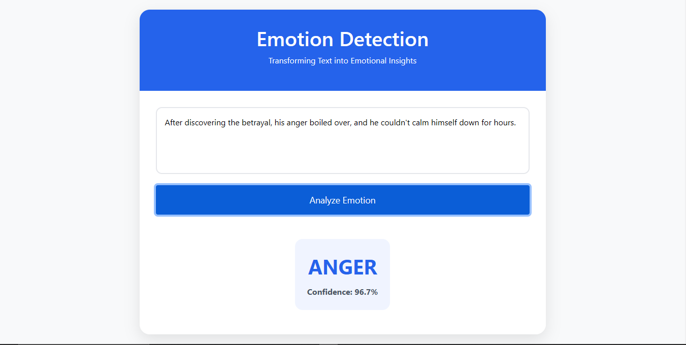
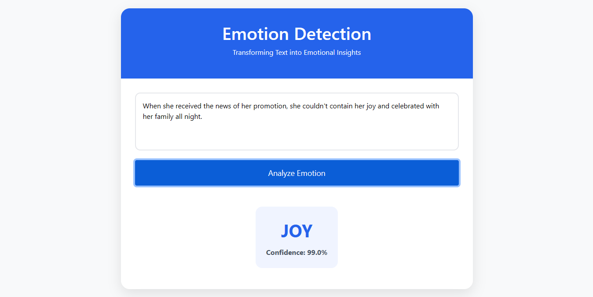

# BERT Emotion Detection

A deep learning model for text emotion classification using BERT transformer architecture. Classifies text into six emotions: sadness, joy, love, anger, fear, and surprise.

## Table of Contents
- [Project Overview](#project-overview)
- [Features](#features)
- [Project Structure](#project-structure)
- [Requirements](#requirements)
- [Installation](#installation)
- [Dataset Setup](#dataset-setup)
- [Usage](#usage)
- [Model Architecture](#model-architecture)
- [Training](#training)
- [Results](#results)
- [Deployment](#deployment)

## Project Overview
This project implements a BERT-based sequence classification model for emotion detection. The system:
- Uses pretrained BERT-base model
- Handles class imbalance through weighted loss
- Implements learning rate scheduling
- Achieves 92.35% accuracy on test set
- Includes Flask web interface for predictions

## Features
- BERT-base uncased model with custom classifier
- Automatic dataset loading from Hugging Face
- Class weights for imbalance handling
- Training progress tracking with TensorBoard
- Model checkpointing
- Flask web deployment
- Comprehensive performance metrics

## Project Structure
```
BERT-Emotion-Detection/
├── checkpoints/               # Saved model checkpoints
│   └── checkpoints_instructions.md
├── logs/                      # Training logs for TensorBoard
├── deployment/                # Deployment files
│   ├── app.py
│   └── requirements.txt
├── images/                    # Example predictions 
│   ├── anger_example.png
│   ├── joy_example.png
│   ├── fear_example.png
│   ├── love_example.png
│   ├── sadness_example.png
│   └── surprise_example.png
├── src/                       # Core source code
│   ├── config.py             # Configuration parameters
│   ├── data_preprocessing.py # Dataset handling
│   ├── model.py             # Model definition
│   ├── train.py             # Training logic
│   └── evaluate.py          # Evaluation scripts
├── BERT_Emotion_Detection.ipynb  # Complete Colab notebook
├── main.py                   # Main execution script
├── requirements.txt          # Python dependencies
└── README.md                # This documentation
```

## Requirements
- Python 3.8+
- PyTorch 2.0+
- CUDA 11.7 (recommended)
- See requirements.txt for full dependency list

## Installation
1. Clone the repository:

2. Create virtual environment (recommended):
```bash
python -m venv venv
source venv/bin/activate  # Linux/Mac
# venv\Scripts\activate  # Windows
```

3. Install dependencies:
```bash
pip install -r requirements.txt
```

## Dataset Setup
The model uses the Emotion dataset from Hugging Face Datasets. The data will be automatically downloaded during first run. No manual setup required.

## Usage

### Training
```bash
python main.py --mode train
```

### Evaluation
```bash
python main.py --mode evaluate
```

### Inference
```python
from main import predict

text = "I'm thrilled about this wonderful opportunity!"
print(predict(text))  # Output: 'joy'
```

## Model Architecture
- **Base Model**: BERT-base-uncased
- **Classifier**: Single linear layer
- **Sequence Length**: 64 tokens
- **Tokenizer**: BERT WordPiece
- **Loss Function**: Weighted Cross-Entropy
- **Optimizer**: AdamW
- **Learning Rate**: 2e-5 with linear warmup

## Training
- **Batch Size**: 32
- **Epochs**: 5
- **Warmup Steps**: 100
- **Weight Decay**: 0.01
- **Gradient Clipping**: 1.0

Training progress can be monitored with TensorBoard:
```bash
tensorboard --logdir logs/
```

## Results

### Performance Metrics
| Metric        | Value   |
|---------------|---------|
| Accuracy      | 92.35%  |
| Macro F1      | 88.40%  |
| Test Loss     | 0.1999  |

### Classification Report
```
              precision    recall  f1-score   support

     sadness       0.97      0.95      0.96       581
         joy       0.98      0.91      0.95       695
        love       0.75      0.97      0.85       159
       anger       0.92      0.92      0.92       275
        fear       0.87      0.90      0.89       224
    surprise       0.70      0.80      0.75        66
```

### Example Predictions



## Deployment
To launch the Gradio web interface:
```bash
cd deployment
python app.py
```
Access the interface at http://localhost:7860

Key Features:
- Real-time text input
- Probability distribution display
- Example buttons for quick testing

---
For questions or issues, please open an issue in the GitHub repository.
