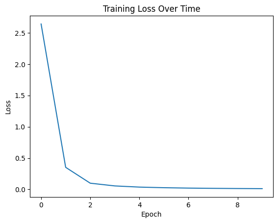

# MiniGPT: A PyTorch Implementation of GPT from Scratch

A lightweight, educational implementation of the GPT (Generative Pre-trained Transformer) architecture built from scratch using PyTorch. This project demonstrates the core concepts of transformer-based language models through a simple, pattern-learning task.

## 📋 Overview

MiniGPT is a minimal implementation of the GPT architecture that learns to predict numerical sequences. The project includes:

- Complete transformer architecture implementation
- Multi-head self-attention mechanism
- Position embeddings
- Training and generation utilities
- Synthetic dataset generation for testing

The model successfully learns to predict sequential patterns, demonstrating the fundamental capabilities of transformer-based architectures.

## 🔍 Project Structure

```
minigpt/
├── config/
│   └── hyperparameters.py      # Model and training hyperparameters
├── data/
│   └── dataset.py              # Synthetic dataset generation
├── models/
│   ├── attention.py            # Multi-head attention implementation
│   ├── transformer.py          # Transformer block implementation
│   └── gpt.py                  # Complete GPT model architecture
├── utils/
│   ├── training.py             # Training loop and utilities
│   └── generation.py           # Sequence generation utilities
├── main.py                     # Main training and evaluation script
├── requirements.txt            # Project dependencies
├── Training_Loss_Convergence   # Training loss
└── README.md                   # Project documentation
```
Training_Loss_Convergence
## ⚙️ Installation

1. Clone the repository:

2. Create and activate a virtual environment (optional but recommended):
```bash
python -m venv venv
source venv/bin/activate  # On Windows, use `venv\Scripts\activate`
```

3. Install dependencies:
```bash
pip install -r requirements.txt
```

## 🚀 Usage

1. Train the model:
```bash
python main.py
```

This will:
- Initialize the GPT model
- Generate synthetic training data
- Train the model
- Display training progress and loss
- Generate example predictions

## 📊 Results

### Training Loss
The model shows excellent convergence during training:



### Generation Results
The model achieves perfect pattern recognition and generation:

```
Making predictions with trained model:
--------------------------------------------------

Test Case 1:
Start sequence:     [1, 2, 3]
Full generation:    [1, 2, 3, 4, 5, 6, 7, 8, 9, 10, 11, 12, 13, 14, 15, 16, 17, 18, 19, 20]
Generated portion:  [4, 5, 6, 7, 8, 9, 10, 11, 12, 13, 14, 15, 16, 17, 18, 19, 20]
Pattern accuracy:   100.00%

Test Case 2:
Start sequence:     [10, 11, 12]
Full generation:    [10, 11, 12, 13, 14, 15, 16, 17, 18, 19, 20, 21, 22, 23, 24, 25, 26, 27, 28, 29]
Generated portion:  [13, 14, 15, 16, 17, 18, 19, 20, 21, 22, 23, 24, 25, 26, 27, 28, 29]
Pattern accuracy:   100.00%
```

## 🔧 Model Architecture

### Key Components

1. **Multi-Head Attention (`models/attention.py`)**
   - Implements scaled dot-product attention
   - Supports multiple attention heads
   - Includes linear projections for queries, keys, and values

2. **Transformer Block (`models/transformer.py`)**
   - Multi-head self-attention layer
   - Feed-forward neural network
   - Layer normalization and residual connections

3. **GPT Model (`models/gpt.py`)**
   - Token embeddings
   - Positional embeddings
   - Stack of transformer blocks
   - Output layer for predictions

### Hyperparameters

The model uses the following default hyperparameters (configurable in `config/hyperparameters.py`):

```python
vocab_size = 100
embed_size = 256
num_layers = 3
heads = 4
forward_expansion = 4
dropout = 0.1
max_length = 20
batch_size = 32
epochs = 10
learning_rate = 3e-4
```

## 📝 Implementation Details

### Synthetic Dataset
- Generates sequences following simple patterns
- Each sequence follows the pattern: [x, x+1, x+2, ...]
- Customizable sequence length and vocabulary size

### Training
- Uses AdamW optimizer
- CrossEntropyLoss for sequence prediction
- Implements teacher forcing during training
- Progress tracking with tqdm

### Generation
- Autoregressive generation
- Supports variable-length input sequences
- Maximum sequence length control
- Pattern accuracy evaluation

## 🛠️ Customization

You can customize the model by modifying the hyperparameters in `config/hyperparameters.py`:

```python
# Example: Increase model capacity
hp = Hyperparameters()
hp.embed_size = 512
hp.num_layers = 6
hp.heads = 8
```

## 📚 References

1. Vaswani, A., et al. (2017). [Attention Is All You Need](https://arxiv.org/pdf/1706.03762)
2. Radford, A., et al. (2018). [Improving Language Understanding by Generative Pre-Training](https://cdn.openai.com/research-covers/language-unsupervised/language_understanding_paper.pdf)


## ✨ Acknowledgments

- Thanks to the PyTorch team for their excellent deep learning framework
- Inspired by the original GPT paper and implementation

