# Multi-Agent System for Data Analysis

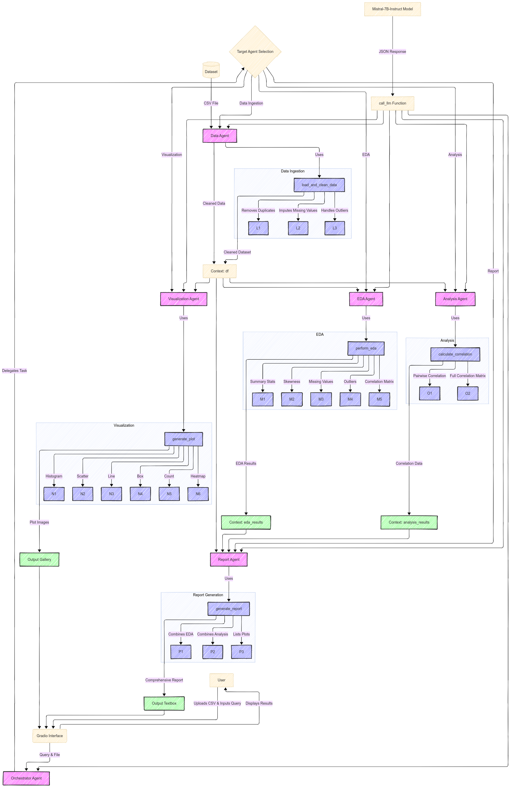

**Multi-Agent_System_for_Data_Analysis** is an advanced, modular data science tool that leverages a multi-agent architecture powered by the Mistral-7B-Instruct model from Hugging Face. This system automates data ingestion, exploratory data analysis (EDA), visualization, statistical analysis, and comprehensive report generation. Built with Python and integrated with a Gradio interface, it provides an intuitive way to interact with datasets and perform complex data science tasks through natural language queries.

## Table of Contents
1. [Features](#features)
2. [Demo](#demo)
3. [Installation](#installation)
4. [Usage](#usage)
   - [Running the Application](#running-the-application)
   - [Example Queries](#example-queries)
5. [Project Structure](#project-structure)
6. [Dependencies](#dependencies)
7. [Configuration](#configuration)
8. [Screenshots](#screenshots)
9. [Contributing](#contributing)
10. [License](#license)
11. [Acknowledgements](#acknowledgements)

---

## Features

- **Data Ingestion**: Load and clean CSV datasets, handling duplicates, missing values, and outliers.
- **Exploratory Data Analysis (EDA)**: Generate summary statistics, detect skewness, identify missing values, and find outliers.
- **Visualization**: Create various plots (e.g., scatter, line, histogram, box, heatmap) with automatic column detection.
- **Statistical Analysis**: Calculate correlations between numeric columns with a full correlation matrix.
- **Report Generation**: Compile a comprehensive report summarizing data insights, EDA, analysis, and visualizations.
- **Multi-Agent Architecture**: Specialized agents (data, EDA, visualization, analysis, report) orchestrated by a central agent.
- **Natural Language Interface**: Use simple queries to trigger complex data science workflows via the Gradio UI.
- **Efficient Model**: Utilizes Mistral-7B-Instruct with 4-bit quantization for fast inference on GPU or CPU.

---

## Demo

Watch a video demonstration of the project in action:

[Click here to view the demo video](images&videos/Multi-Agent_System_for_Data_Analysis_Demo.mp4)

For detailed examples, see the [Screenshots](#screenshots) section below.

---

## Installation

Follow these steps to set up the project locally:

### Prerequisites
- Python 3.8 or higher
- Git
- A Hugging Face account with an API token (for model access)

### Steps
1. **Clone the Repository**:
   ```bash
   git clone --no-checkout https://github.com/HimadeepRagiri/ML-and-DL-Projects.git
   cd ML-and-DL-Projects
   git sparse-checkout init --cone
   git sparse-checkout set NLP_Projects/Multi-Agent_System_for_Data_Analysis
   cd NLP_Projects/Multi-Agent_System_for_Data_Analysis
   ```

2. **Install Dependencies**:
   Install the required Python packages using the provided `requirements.txt`:
   ```bash
   pip install -r requirements.txt
   ```

3. **Configure Hugging Face Token**:
   - Open `src/config.py`.
   - Replace the `HF_TOKEN` value with your Hugging Face API token:
     ```python
     HF_TOKEN = "your_hugging_face_token_here"
     ```

4. **(Optional) Jupyter Notebook**:
   If you prefer to explore the full implementation interactively, open `Multi-Agent_System_for_Data_Analysis.ipynb` in Jupyter Notebook or JupyterLab:
   ```bash
   jupyter notebook Multi-Agent_System_for_Data_Analysis.ipynb
   ```

5. **Run the Application**:
   See [Running the Application](#running-the-application) below.

---

## Usage

### Running the Application
Launch the Gradio interface to interact with the system:
```bash
python app.py
```
- A browser window will open with the Gradio UI.
- Upload a CSV file and enter a query to start analyzing your data.
- The application supports public sharing via a temporary URL (enabled with `share=True`).

### Example Queries
Below are example queries you can enter in the Gradio textbox after uploading a dataset:

| Query                  | Description                                      | Output Example                     |
|-----------------------|--------------------------------------------------|------------------------------------|
| `load and clean data` | Loads and cleans the uploaded CSV file          | "Loaded and cleaned dataset..."   |
| `perform EDA`         | Runs exploratory data analysis                  | Summary stats, skewness, etc.     |
| `scatter plot`        | Generates a scatter plot with auto-detected cols| Scatter plot image                |
| `histogram`           | Creates a histogram for a numeric column        | Histogram image                   |
| `correlation analysis`| Computes correlations between columns           | Correlation values and matrix     |
| `generate report`     | Produces a full report with all analyses        | Detailed text report              |

**Note**: If no specific columns are mentioned, the system auto-selects appropriate columns based on the dataset.

---

## Project Structure

```
Multi-Agent_System_for_Data_Analysis/
│
├── src/                    # Source code directory
│   ├── __init__.py         # Marks src as a Python package
│   ├── config.py           # Model and token configuration
│   ├── models.py           # Model loading and LLM interaction
│   ├── tools.py            # Data processing and analysis tools
│   ├── agent_outputs.py    # Agent output definitions and logic
│   ├── orchestrator.py     # Orchestrator agent for task delegation
│   └── utils.py            # Utility functions (e.g., JSON parsing)
│
├── app.py                  # Gradio interface and main entry point
├── requirements.txt        # List of Python dependencies
├── README.md               # Project documentation (this file)
├── Multi-Agent_System_for_Data_Analysis.ipynb  # Full Jupyter Notebook implementation
└── images&videos/          # Demo images and video
    ├── Multi_Agent_System_Overview.png  
    ├── load_and_clean.png
    ├── EDA.png
    ├── box_plot.png
    ├── line_plot.png
    ├── count_plot.png
    ├── scatter_plot.png
    ├── histogram.png
    ├── heatmap.png
    ├── correlation_analysis.png
    ├── generate_report.png
    ├── Agent_System_for_Data_Analysis_Demo.mp4
```

### File Descriptions
- **`src/config.py`**: Defines the Hugging Face token, model name, and quantization settings.
- **`src/models.py`**: Loads the Mistral-7B model and tokenizer, and handles LLM calls.
- **`src/tools.py`**: Implements data cleaning, EDA, plotting, correlation, and reporting tools.
- **`src/agents.py`**: Defines Pydantic models and creates specialized agents.
- **`src/orchestrator.py`**: Manages task delegation to appropriate agents.
- **`src/utils.py`**: Provides helper functions like JSON extraction.
- **`app.py`**: Runs the Gradio UI and integrates all components.
- **`Multi-Agent_System_for_Data_Analysis.ipynb`**: Contains the complete, original implementation in a Jupyter Notebook.

---

## Dependencies

The project relies on the following Python packages (listed in `requirements.txt`):
```
bitsandbytes
pandas
torch
matplotlib
seaborn
pydantic
transformers
scipy
gradio
json
re
```

Install them with:
```bash
pip install -r requirements.txt
```

---

## Configuration

To customize the project:
1. **Model Settings**: Modify `MODEL_NAME` or `BNB_CONFIG` in `src/config.py` to use a different model or quantization.
2. **Hugging Face Token**: Ensure `HF_TOKEN` in `src/config.py` is set to your personal token.
3. **Device**: The system auto-detects GPU/CPU (`DEVICE` in `src/config.py`), but you can force CPU usage if needed.

---

## Screenshots

Below are example outputs from the system:

| **Task**               | **Screenshot**                       |
|-----------------------|--------------------------------------|
| Load and Clean Data   | 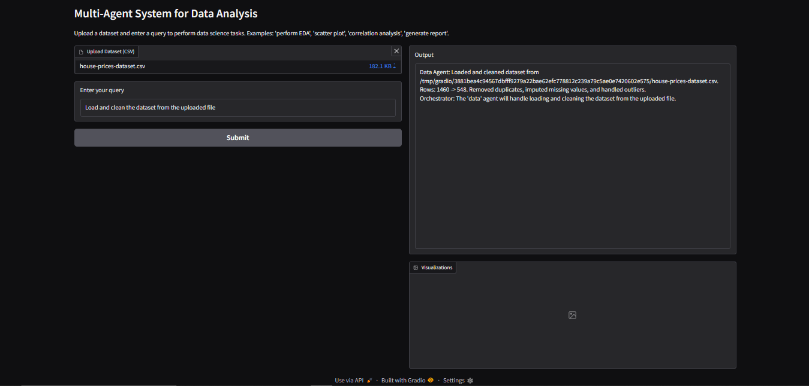 |
| Perform EDA           | 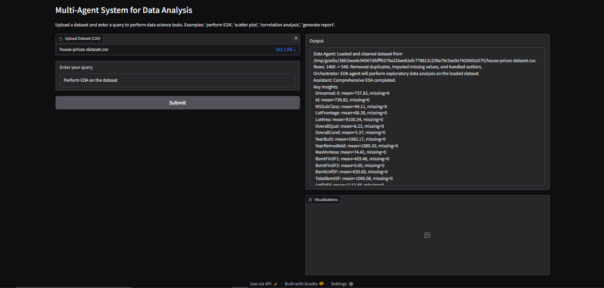       |
| Box Plot              | 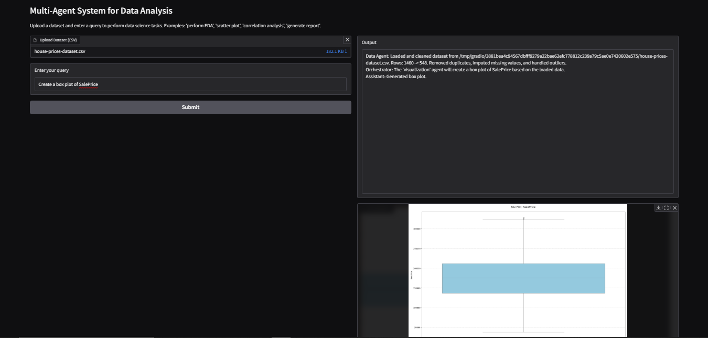 |
| Line Plot             | 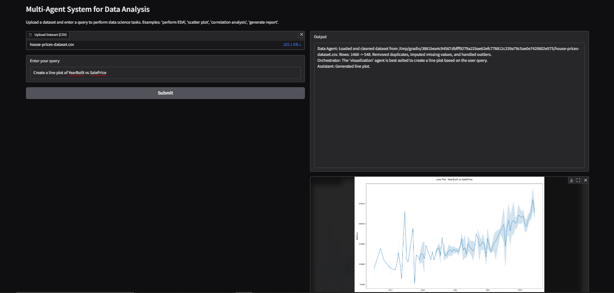 |
| Count Plot            | 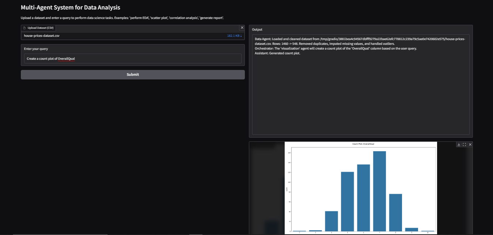 |
| Scatter Plot          | 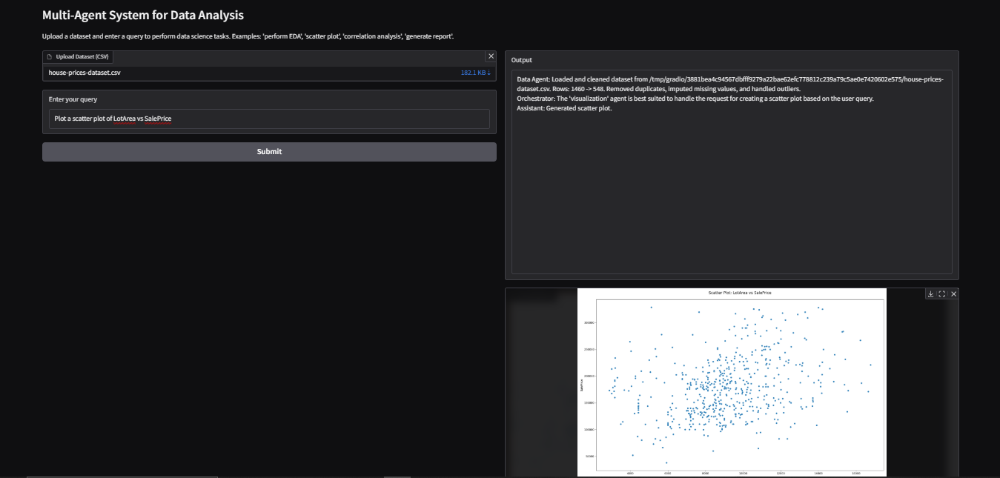 |
| Histogram             | 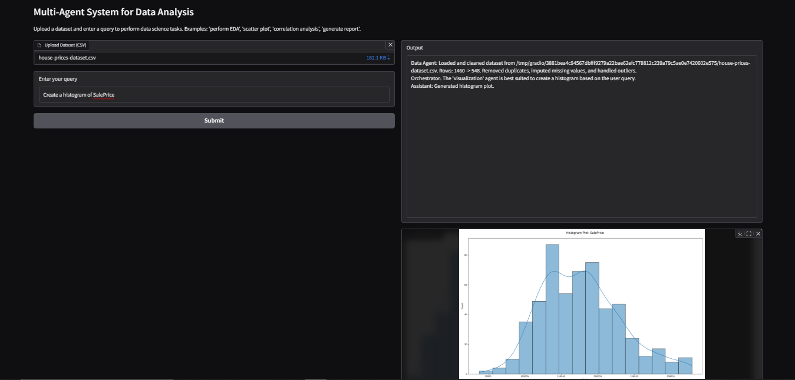 |
| Heatmap               | 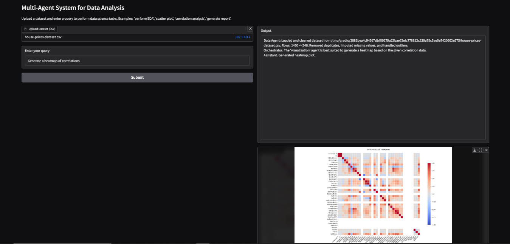 |
| Correlation Analysis  | 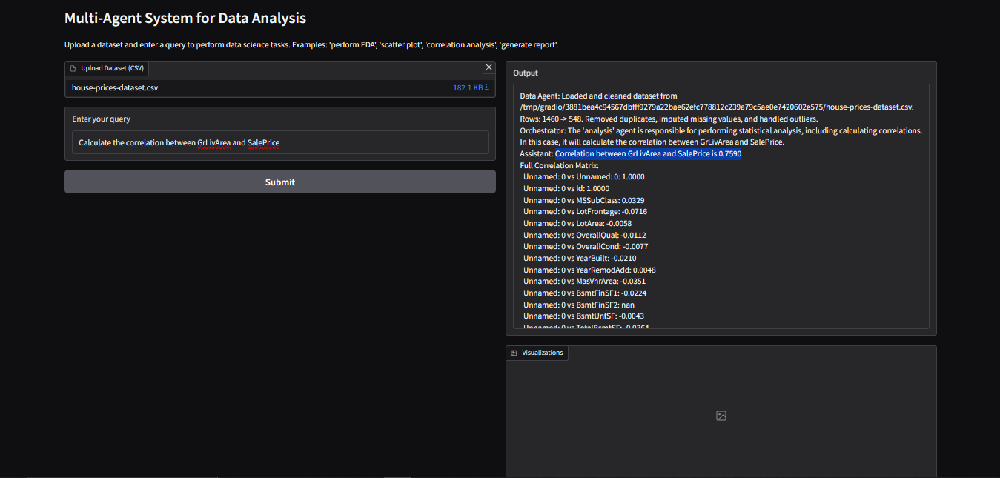 |
| Generate Report       | 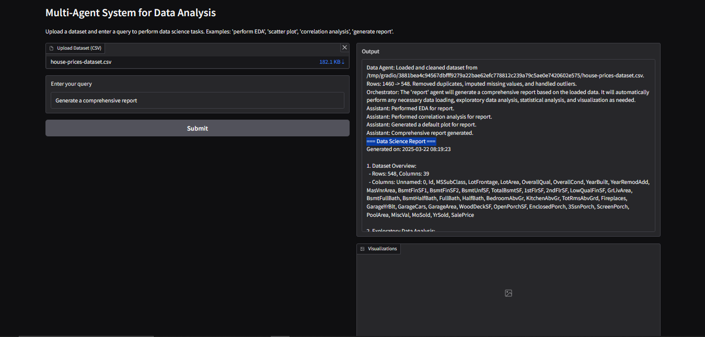 |

---

## Contributing

Contributions are welcome! To contribute:
1. Fork the repository.
2. Create a new branch (`git checkout -b feature/your-feature`).
3. Make your changes and commit (`git commit -m "Add your feature"`).
4. Push to your branch (`git push origin feature/your-feature`).
5. Open a Pull Request.

Please ensure your code follows the existing style and includes appropriate documentation.

---

## License

This project is licensed under the MIT License. See the [LICENSE](../../LICENSE) file for details.

---

## Acknowledgements

- **Hugging Face**: For providing the Mistral-7B-Instruct model and transformers library.
- **Gradio**: For the intuitive web interface framework.
- **Open-Source Community**: For the numerous libraries that made this project possible.

---
