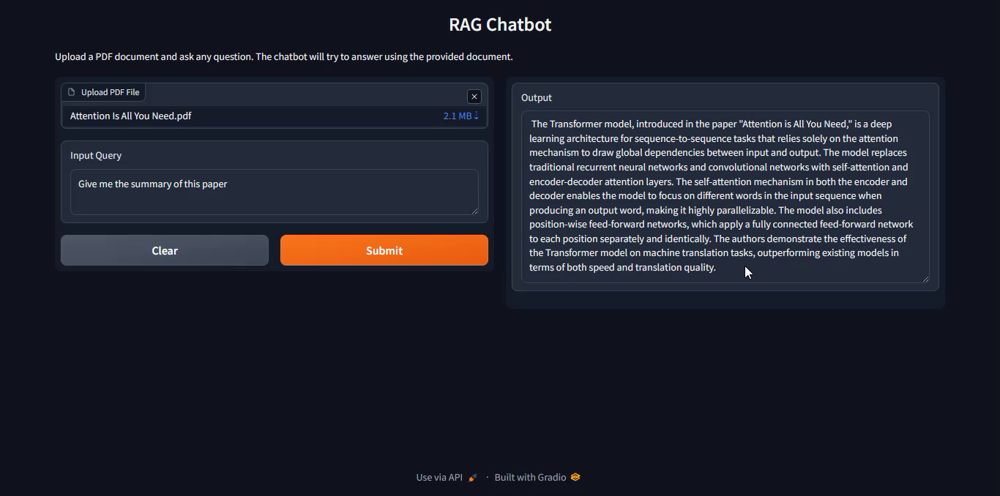

# RAG-Chatbot


## 📑 Table of Contents

- [Overview](#overview)
- [Project Architecture](#project-architecture)
- [Technologies Used](#technologies-used)
- [Features](#features)
- [Installation](#installation)
- [Usage](#usage)
- [Demo](#demo)
- [Project Structure](#project-structure)
- [Components Explained](#components-explained)
  - [LLM Module](#llm-module)
  - [Document Processing](#document-processing)
  - [Vector Database](#vector-database)
  - [Question Answering System](#question-answering-system)
  - [Web Interface](#web-interface)
- [Technical Implementation Details](#technical-implementation-details)
- [Performance Considerations](#performance-considerations)
- [Limitations](#limitations)
- [Future Improvements](#future-improvements)
- [Contribution Guidelines](#contribution-guidelines)
- [Acknowledgments](#acknowledgments)

## 📋 Overview

The RAG-Chatbot is a Retrieval-Augmented Generation system developed as part of the IBM AI Engineer course capstone project on Coursera. This application allows users to upload PDF documents and ask questions about their content, receiving accurate answers based on the document's information rather than pre-existing knowledge.

RAG combines the power of large language models (LLMs) with information retrieval systems, enabling the chatbot to "read" documents and provide contextually relevant answers based on the document content. This approach ensures that the model's responses are grounded in the provided documents rather than relying solely on its pre-trained knowledge.

## 🏗️ Project Architecture

The RAG-Chatbot follows a modular architecture with the following main components:

1. **Document Processing Pipeline**: Handles PDF document ingestion, parsing, and chunking
2. **Embedding System**: Converts text chunks into vector representations
3. **Vector Database**: Stores and retrieves document vectors efficiently
4. **LLM Integration**: Connects with IBM watsonx.ai's Mixtral model for generation
5. **Retrieval Mechanism**: Finds relevant document sections based on queries
6. **Web Interface**: Provides a user-friendly front-end using Gradio

## 🛠️ Technologies Used

- **IBM watsonx.ai**: For accessing Mixtral 8x7B Instruct model and embedding models
- **LangChain**: Framework for building LLM-powered applications
- **ChromaDB**: Vector database for storing document embeddings
- **PyPDF**: Library for parsing PDF documents
- **Gradio**: Web interface framework for creating the user interface
- **Python 3.9+**: Core programming language

## ✨ Features

- **PDF Document Processing**: Upload and process any PDF document
- **Semantic Search**: Find relevant information based on meaning, not just keywords
- **Contextual Question Answering**: Get answers specifically tailored to document content
- **User-friendly Interface**: Simple web UI for easy interaction
- **Fast Response Time**: Optimized for quick answers to user queries
- **Context Preservation**: Maintains document context when generating answers

## 📥 Installation

### Prerequisites

- Python 3.9 or higher
- pip package manager
- Git (for cloning the repository)

### Step-by-step Installation

1. **Clone the repository**:
   ```bash
   git clone --no-checkout https://github.com/HimadeepRagiri/ML-and-DL-Projects.git
   cd ML-and-DL-Projects
   git sparse-checkout init --cone
   git sparse-checkout set NLP_Projects/RAG-Chatbot
   cd NLP_Projects/RAG-Chatbot
   ```

2. **Create a virtual environment** (optional but recommended):
   ```bash
   python -m venv venv
   
   # On Windows
   venv\Scripts\activate
   
   # On macOS/Linux
   source venv/bin/activate
   ```

3. **Install the required dependencies**:
   ```bash
   pip install -r requirements.txt
   ```

4. **Verify installation**:
   ```bash
   python -c "import langchain, ibm_watsonx_ai, gradio; print('Installation successful!')"
   ```

## 🚀 Usage

### Running the Application

1. **Start the application**:
   ```bash
   python app.py
   ```

2. **Access the web interface**:
   Open your browser and navigate to `http://localhost:7860`

### Using the RAG-Chatbot

1. **Upload a PDF document**:
   Click on the "Upload PDF File" button and select a PDF document from your computer.

2. **Ask a question**:
   Type your question in the input field. Make sure your question is related to the content of the uploaded document.

3. **Get the answer**:
   Click "Submit" and wait for the system to process your query. The answer will appear in the output section.

### Example Queries

- "What is the main concept discussed in this paper?"
- "Summarize the methodology section."
- "What conclusions did the authors reach?"
- "What are the limitations mentioned in the research?"

## 🎬 Demo

This repository includes demo files showing the RAG-Chatbot in action:

- **Image1**: Shows the system summarizing the "Attention Is All You Need" paper
- **Image2**: Demonstrates the chatbot explaining the "Low Rank Adaptation" paper
- **RAG-Chatbot_Demo**: A video recording showing the complete workflow from uploading a PDF to getting answers



## 📁 Project Structure

```
RAG-Chatbot/
├── README.md                   # Project documentation
├── requirements.txt            # Dependencies list
├── src/
│   ├── __init__.py             # Makes src a Python package
│   ├── llm.py                  # LLM and embedding setup
│   ├── document.py             # Document loading and processing
│   ├── vector_db.py            # Vector database operations
│   └── qa.py                   # QA chain implementation
├── app.py                      # Main Gradio application
└── images-videos/              # Demo images and videos
    ├── Image1.png              # Attention Is All You Need paper summary
    ├── Image2.png              # Low Rank Adaptation paper summary
    └── RAG-Chatbot_Demo.mp4    # Demo video
```

## 🧩 Components Explained

### LLM Module

The `llm.py` module initializes and configures the Language Model and embedding model from IBM watsonx.ai:

- **WatsonxLLM**: Implements the Mixtral 8x7B Instruct model for generating responses
- **WatsonxEmbeddings**: Uses the IBM Slate-125M model for converting text to vector embeddings

Key configuration parameters:
- Maximum tokens: 256
- Temperature: 0.5 (balanced between creativity and accuracy)
- Project ID: "skills-network" (IBM watsonx.ai project identifier)

### Document Processing

The `document.py` module handles PDF document ingestion and preprocessing:

- **PyPDFLoader**: Extracts text content from PDF files
- **RecursiveCharacterTextSplitter**: Divides documents into manageable chunks with the following parameters:
  - Chunk size: 1000 characters
  - Chunk overlap: 50 characters (ensures context continuity)

This chunking strategy is crucial for effective retrieval, balancing context preservation with database efficiency.

### Vector Database

The `vector_db.py` module manages the vector storage and retrieval:

- **ChromaDB**: In-memory vector database for storing document embeddings
- **Retriever**: Interface for semantic search queries against the database

The system:
1. Converts document chunks to vector embeddings
2. Stores these vectors in ChromaDB
3. Creates a retriever object for semantic search

### Question Answering System

The `qa.py` module implements the QA chain combining retrieval and generation:

- **RetrievalQA**: LangChain chain that connects the retriever with the LLM
- Uses the "stuff" chain type: retrieves relevant chunks and combines them into a single context
- Processes user queries to generate contextually relevant answers

### Web Interface

The `app.py` file creates the user interface using Gradio:

- **File Upload**: Accepts PDF files
- **Text Input**: For user queries
- **Text Output**: Displays the generated answers
- **Warning Suppression**: Cleans up the console output

## 🔍 Technical Implementation Details

### Embedding Process

The system uses IBM's Slate-125M model to create dense vector representations of text chunks. Each chunk is transformed into a high-dimensional vector that captures its semantic meaning, allowing for similarity-based retrieval.

### Retrieval Mechanism

When a query is submitted:
1. The query is converted to an embedding vector
2. The system computes similarity scores between the query vector and document vectors
3. Most similar chunks are retrieved (default: top k=4)
4. Retrieved chunks are combined to form the context for the LLM

### Response Generation

The Mixtral 8x7B Instruct model:
1. Receives a carefully crafted prompt containing the retrieved context and user query
2. Generates a response focusing on the provided context
3. Returns an answer that directly addresses the user's question based on document content

## ⚙️ Performance Considerations

- **Memory Usage**: The application loads document vectors into memory, so large documents may require more RAM
- **Processing Time**: Initial document processing involves PDF parsing, text extraction, chunking, and embedding generation, which may take time for large documents
- **Query Latency**: Typical query-to-answer time is 2-5 seconds, depending on document size and query complexity

## ⚠️ Limitations

- **PDF Format Dependency**: Currently only supports PDF files; other document formats are not supported
- **Text-Only Processing**: Cannot process images, charts, or tables within PDFs
- **Context Window Limit**: Maximum context size limits the amount of document information that can be used for a single query
- **Language Support**: Best performance with English-language documents
- **Embedding Quality**: Retrieval quality depends on the embedding model's capability to capture semantic meaning

## 🔮 Future Improvements

Potential enhancements for future versions:

- **Multi-Document Support**: Allow querying across multiple documents simultaneously
- **Additional File Formats**: Add support for DOCX, TXT, CSV, and other common formats
- **Image and Table Processing**: Integrate OCR and table extraction capabilities
- **Fine-Tuning Options**: Allow users to fine-tune the model for specific domains
- **Advanced Querying**: Implement query planning for complex multi-part questions
- **Conversational Memory**: Add support for follow-up questions with context preservation
- **Export Capabilities**: Allow exporting of question-answer pairs to various formats
- **Authentication System**: Add user accounts and document privacy controls

## 🤝 Contribution Guidelines

Contributions to improve RAG-Chatbot are welcome! Please follow these steps:

1. Fork the repository
2. Create a feature branch: `git checkout -b feature/your-feature-name`
3. Commit your changes: `git commit -m 'Add some feature'`
4. Push to the branch: `git push origin feature/your-feature-name`
5. Open a Pull Request

## 🙏 Acknowledgments

- IBM and Coursera for providing the AI Engineer course and resources
- The LangChain team for their excellent framework
- The open-source community for the various libraries used in this project
- Fellow course participants for their feedback and suggestions

---

📊 **Developed as part of the IBM AI Engineer Capstone Project on Coursera**